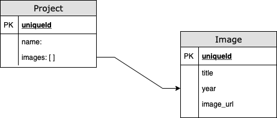
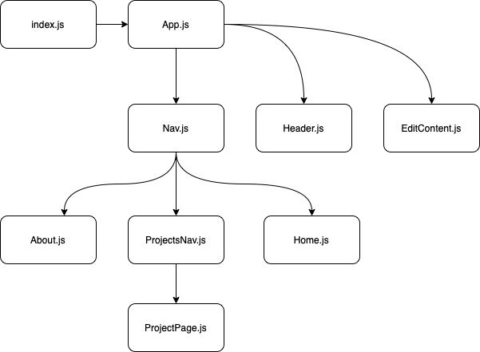

# Portfolio Builder
## A full MERN stack application
By: Christopher Bowers

[LinkedIn](https://linkedin.com/in/christopher-bowers-dev) | [Twitter](https://twitter.com/chrisipedia)

[Trello Board](https://trello.com/b/uo3BYHui)

### ERD


### React Component Diagram



## Description

This site is a basic web app for building a basic portfolio site with projects and images.

## Technologies

 - React
 - node.js
 - Express
 - MongoDB
 - CSS

## How to Get Started

### Run locally

```
$ git@github.com:christopherbowers/portfolio_builder.git
$ cd portfolio_builder
$ npm i
$ npm start
$ cd client
$ npm i
$ npm start
```

## Credits